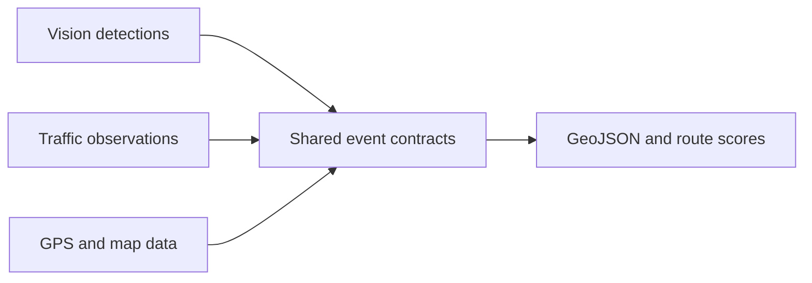

# OpenTrace ML

[](https://github.com/vrajpatell/opentrace-ml/actions/workflows/ci.yml)
[](LICENSE)
[](pyproject.toml)

OpenTrace ML is an early-stage Python library that connects computer-vision
detections, live traffic forecasts, and map signals into reusable road and route
intelligence.

The first release provides a small, model-agnostic foundation:

- parse RDD2022-style road-damage annotations;
- interpolate timestamped detections onto GPS traces;
- learn traffic patterns incrementally with `partial_fit`;
- score route reliability using damage, congestion, map uncertainty, and distance;
- export routes and detections as GeoJSON.
- evaluate detection output and rolling traffic forecasts.
- prepare consented GPS traces with pseudonymized IDs and deterministic cleaning.

OpenTrace ML does not yet ship a trained detector, routing service, web app, or
third-party dataset. Those capabilities are staged in the roadmap.

## How the pieces connect



## Supported public data

| Source | First use | Licence |
|---|---|---|
| RDD2022 | Road-damage detection annotations | CC BY 4.0 |
| UCI Metro Interstate Traffic Volume | Incremental traffic forecasting | CC BY 4.0 |
| OpenStreetMap | Road-network geometry | ODbL 1.0 |

Dataset files are downloaded by the user and remain under their original
licences. See [DATA_LICENSES.md](DATA_LICENSES.md) before downloading,
redistributing, or publishing derived data.

## Install

```bash
python -m venv .venv
source .venv/bin/activate
pip install -e .
```

Add the public-data or map integrations only when needed:

```bash
pip install -e '.[data,geo]'
```

## Quick start

```python
from opentrace_ml import GeoPoint, detections_to_geojson, geolocate_detections
from opentrace_ml.vision import parse_pascal_voc

detections = parse_pascal_voc("India_000001.xml", timestamp_seconds=5.0)
trace = [
    GeoPoint(22.3072, 73.1812, 0.0),
    GeoPoint(22.3080, 73.1830, 10.0),
]

located = geolocate_detections(detections, trace)
geojson = detections_to_geojson(located)
```

## Prepare a private GPX trace

The trace-preparation boundary requires explicit consent, replaces the raw trip
identifier with an HMAC pseudonym, removes exact duplicate samples and implausible
speed jumps, and normalizes timestamps. Never use a hardware device ID as `trip_id`.

```python
import os
from opentrace_ml import load_gpx_points, prepare_trace

points = load_gpx_points("trip.gpx")
trace = prepare_trace(points, trip_id="export-123",
                      secret_key=os.environ["OPENTRACE_PSEUDONYM_KEY"], consent_granted=True)
```

`trace.points` still contains sensitive coordinates. Keep it inside the private
processing pipeline and publish only reviewed, aggregated outputs. See
[stage three](docs/STAGE_3.md) for the privacy and threat-model boundaries.

## Public-data examples

```bash
# Download the CC BY 4.0 UCI dataset through ucimlrepo and forecast 24 hours.
python examples/forecast_uci.py

# Reads an already downloaded/extracted RDD2022 directory.
python examples/rdd_annotations.py /path/to/RDD2022

# Downloads an OSM driving graph and prints its size.
python examples/osm_graph.py

# Prints only a pseudonymous trip ID and aggregate cleaning counts.
OPENTRACE_PSEUDONYM_KEY='replace-with-a-secret' \
  python examples/prepare_gpx_trace.py trip.gpx --trip-id export-123 --consent
```

## Try the current stage

Create a GeoJSON road-survey layer from an RDD2022-style annotation:

```bash
python examples/road_damage_route_demo.py tests/fixtures/rdd_sample.xml
```

Backtest the live forecaster on public UCI traffic data:

```bash
pip install -e '.[data]'
python examples/traffic_backtest.py
```

The current APIs can also support small GIS dashboards, annotation review tools,
traffic-monitoring baselines, and experimental route-comparison services. See
[current-stage use cases](docs/USE_CASES.md) and the [stage-two plan](docs/STAGE_2.md).

## Test

The core test suite uses only a tiny original XML fixture and does not download
third-party data:

```bash
PYTHONPATH=src python -m unittest discover -s tests -v
```

## Core modules

| Module | Responsibility |
|---|---|
| `models.py` | Stable detection and GPS data contracts |
| `vision.py` | Model-agnostic annotation parsing |
| `geo.py` | GPS interpolation, distances, and GeoJSON |
| `gpx.py` | Timestamped GPX loading and normalization |
| `trace.py` | Consent, pseudonymization, and trace cleaning |
| `forecasting.py` | Incremental traffic-volume forecasting |
| `routing.py` | Transparent, auditable route scoring |
| `datasets.py` | Metadata and optional public-data adapters |
| `protocols.py` | External model adapter contracts |
| `evaluation.py` | Detection metrics and rolling forecast evaluation |

## Design principle

Detectors, forecasting models, and routing engines should evolve independently.
The shared contracts let developers replace one component without rewriting the
rest of the pipeline. See [the architecture notes](docs/ARCHITECTURE.md).

## Project status

OpenTrace ML is pre-alpha. Its APIs may change while the first reproducible
computer-vision and forecasting baselines are developed. See the
[roadmap](docs/ROADMAP.md) and [contribution guide](CONTRIBUTING.md).

## License

OpenTrace ML source code is licensed under the Apache License 2.0.

External datasets, map data, model weights, and generated derivative databases
are not covered by Apache-2.0. Each resource remains subject to its original
licence and attribution requirements. See [DATA_LICENSES.md](DATA_LICENSES.md).
