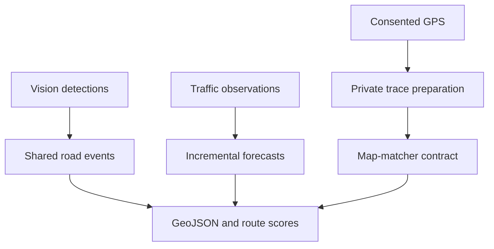

# OpenTrace ML

[](https://github.com/vrajpatell/opentrace-ml/actions/workflows/ci.yml)
[](LICENSE)
[](pyproject.toml)
[](https://github.com/vrajpatell/opentrace-ml/discussions)

OpenTrace ML is a pre-alpha Python library for building road-intelligence
applications from computer-vision detections, incremental traffic forecasts, and
privacy-aware map signals.

The project provides small, model-independent building blocks rather than a
hosted routing service. Applications can adopt one component without coupling
their detector, forecasting model, map matcher, or routing engine to the rest of
the stack.

## What works today

| Area | Available capability |
|---|---|
| Computer vision | Parse RDD2022-style Pascal VOC annotations and adapt callable detectors |
| Evaluation | Calculate detection metrics and rolling traffic-forecast backtests |
| Forecasting | Learn traffic-volume patterns incrementally with `partial_fit` |
| Geospatial | Interpolate detections onto GPS traces and export GeoJSON |
| Private traces | Enforce consent, pseudonymize trip IDs, and clean GPX samples |
| Map matching | Validate ordered matched and unmatched observations through an engine-independent contract |
| Routing | Score route reliability from damage, congestion, map uncertainty, and distance |

OpenTrace ML does **not** yet ship a trained detector, live API, routing service,
web application, third-party dataset, or production map-matcher integration.
These are staged in the [roadmap](docs/ROADMAP.md).

## Architecture



Raw coordinates remain inside the private trace-processing boundary. Public
outputs should be thresholded aggregates that have passed documented human
review; OpenTrace never treats one unmatched trace as a missing road.

## Install

OpenTrace ML supports Python 3.10, 3.11, and 3.12.

```bash
git clone https://github.com/vrajpatell/opentrace-ml.git
cd opentrace-ml
python -m venv .venv
source .venv/bin/activate
pip install -e '.[dev]'
```

Install optional public-data and OpenStreetMap integrations only when needed:

```bash
pip install -e '.[data,geo]'
```

## Five-minute offline demo

The repository fixtures are original, tiny, and require no dataset download or
network service.

```bash
# Convert a sample road-damage annotation into a GeoJSON survey layer.
python examples/road_damage_route_demo.py tests/fixtures/rdd_sample.xml

# Exercise the map-matcher contract with a synthetic GPX fixture.
OPENTRACE_PSEUDONYM_KEY='replace-with-a-secret' \
  python examples/map_match_fixture.py

# Run the complete test suite.
python -m pytest -q
```

## Python quick start

```python
from opentrace_ml import GeoPoint, detections_to_geojson, geolocate_detections
from opentrace_ml.vision import parse_pascal_voc

detections = parse_pascal_voc("India_000001.xml", timestamp_seconds=5.0)
trace = [
    GeoPoint(22.3072, 73.1812, 0.0),
    GeoPoint(22.3080, 73.1830, 10.0),
]

located = geolocate_detections(detections, trace)
geojson = detections_to_geojson(located)
```

## Prepare a private GPX trace

Trace preparation requires explicit consent, replaces the raw trip identifier
with an HMAC pseudonym, removes exact duplicate samples and implausible speed
jumps, and normalizes timestamps. Never use a hardware device ID as `trip_id`.

```python
import os

from opentrace_ml import load_gpx_points, prepare_trace

points = load_gpx_points("trip.gpx")
trace = prepare_trace(
    points,
    trip_id="export-123",
    secret_key=os.environ["OPENTRACE_PSEUDONYM_KEY"],
    consent_granted=True,
)
```

`trace.points` still contains sensitive coordinates. Keep it inside the private
pipeline and publish only reviewed, aggregated outputs. Read the
[privacy-safe trace stage](docs/STAGE_3.md) and
[map-matching stage](docs/STAGE_4.md) before integrating real traces.

## Public-data examples

These examples require the corresponding optional dependency or a user-provided
dataset download:

```bash
# Download the CC BY 4.0 UCI dataset and forecast 24 hours.
python examples/forecast_uci.py

# Read an already downloaded and extracted RDD2022 directory.
python examples/rdd_annotations.py /path/to/RDD2022

# Download an OSM driving graph and print its size.
python examples/osm_graph.py

# Backtest the traffic forecaster on public UCI data.
python examples/traffic_backtest.py
```

## Choose a contribution

New contributors can start with one bounded issue:

| Interest | Suggested issue |
|---|---|
| OpenStreetMap and routing | [#3 — Add a tiny offline OSM integration fixture](https://github.com/vrajpatell/opentrace-ml/issues/3) |
| Computer-vision evaluation | [#2 — Add per-class road-damage metrics](https://github.com/vrajpatell/opentrace-ml/issues/2) |
| Detector integrations | [#4 — Add an optional MMDetection/RTMDet adapter](https://github.com/vrajpatell/opentrace-ml/issues/4) |
| GPS processing | [#8 — Split traces around long recording gaps](https://github.com/vrajpatell/opentrace-ml/issues/8) |
| Privacy and aggregation | [#10 — Add a minimum-contributor gate](https://github.com/vrajpatell/opentrace-ml/issues/10) |
| Security documentation | [#11 — Document key rotation and retention](https://github.com/vrajpatell/opentrace-ml/issues/11) |

If you are unsure where to begin, introduce yourself in
[GitHub Discussions](https://github.com/vrajpatell/opentrace-ml/discussions) with
your interests in Python, ML, computer vision, GIS, routing, privacy, testing, or
documentation. You can also comment on an issue before starting work.

## Contributing

1. Read [CONTRIBUTING.md](CONTRIBUTING.md) and
   [DATA_LICENSES.md](DATA_LICENSES.md).
2. Fork the repository and create a focused branch.
3. Add tests for externally visible behavior.
4. Run `ruff check .` and `python -m pytest -q`.
5. Open a pull request describing the behavior and data/licensing impact.

Do not commit datasets, private GPS traces, credentials, or model weights.

## Supported public data

| Source | First use | Licence |
|---|---|---|
| RDD2022 | Road-damage detection annotations | CC BY 4.0 |
| UCI Metro Interstate Traffic Volume | Incremental traffic forecasting | CC BY 4.0 |
| OpenStreetMap | Road-network geometry | ODbL 1.0 |

Dataset files are downloaded by the user and remain under their original
licences. See [DATA_LICENSES.md](DATA_LICENSES.md) before downloading,
redistributing, or publishing derived data.

RDD2022-derived detections are application-layer signals, not an authorized
source for editing OpenStreetMap. OpenTrace does not upload them to OSM.

## Core modules

| Module | Responsibility |
|---|---|
| `models.py` | Stable detection and GPS data contracts |
| `vision.py` | Model-agnostic annotation parsing |
| `protocols.py` | External detector adapter contracts |
| `evaluation.py` | Detection metrics and rolling forecast evaluation |
| `forecasting.py` | Incremental traffic-volume forecasting |
| `geo.py` | GPS interpolation, distances, and GeoJSON |
| `gpx.py` | Timestamped GPX loading and normalization |
| `trace.py` | Consent, pseudonymization, and trace cleaning |
| `map_matching.py` | Engine-independent matched/unmatched trace contracts |
| `routing.py` | Transparent, auditable route scoring |
| `datasets.py` | Metadata and optional public-data adapters |

See the [architecture notes](docs/ARCHITECTURE.md),
[current-stage use cases](docs/USE_CASES.md), and [roadmap](docs/ROADMAP.md) for
the design boundaries and planned integrations.

## Project status

Version `0.1.0` is pre-alpha. APIs may change while the first reproducible
computer-vision, forecasting, and route-intelligence integrations are developed.

## License

OpenTrace ML source code is licensed under the Apache License 2.0.

External datasets, map data, model weights, and generated derivative databases
are not covered by Apache-2.0. Each resource remains subject to its original
licence and attribution requirements. See [DATA_LICENSES.md](DATA_LICENSES.md).
